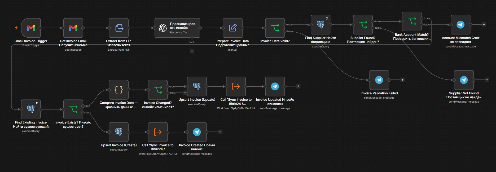
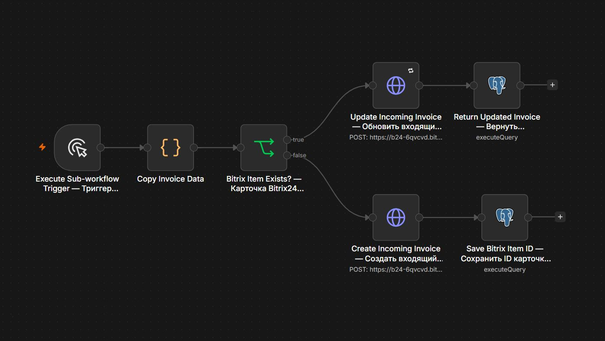

# AI Invoice Processing Engine

[Русская версия](README_RU.md)

AI-powered invoice processing workflow built with **n8n** that extracts invoice data from PDF files, validates business rules, prevents duplicate records, stores invoices in PostgreSQL, and synchronizes them with Bitrix24.

---

## Business Problem

Companies receive supplier invoices by email every day. Manual processing is slow, error-prone, and can lead to duplicate records or payment based on incomplete or unverified bank details.

This workflow automates invoice processing, validates critical business rules, and sends uncertain cases to a manager for manual review.

---

## Workflow Architecture

```text
Gmail Trigger
      ↓
Extract PDF Text
      ↓
AI Invoice Analysis
      ↓
Prepare Invoice Data
      ↓
Invoice Data Valid?
├─ No  → Notify Manager → Stop
└─ Yes → Find Supplier by INN
             ↓
         Supplier Found?
         ├─ No  → Notify Manager → Stop
         └─ Yes → Bank Account Match?
                      ├─ No  → Notify Manager → Stop
                      └─ Yes → Find Existing Invoice
                                   ↓
                               Invoice Exists?
                               ├─ No  → Create in PostgreSQL
                               └─ Yes → Invoice Changed?
                                            ├─ No  → Stop
                                            └─ Yes → Update PostgreSQL
                                                        ↓
                                             Sync Bitrix24 Sub-workflow
                                                        ↓
                                             Telegram Notification
```

---

## Workflow



---

### Bitrix24 Sync Sub-workflow

This sub-workflow creates a new Bitrix24 item or updates the existing one using `bitrix_item_id` stored in PostgreSQL.



## Architecture Principles

* AI extracts and structures invoice data.
* Deterministic workflow logic makes business decisions.
* Required invoice fields are validated before processing.
* PostgreSQL is the Single Source of Truth for suppliers and invoices.
* Suppliers are identified by INN rather than company name.
* The composite business key `supplier_inn + invoice_number` prevents duplicate invoices.
* Existing invoices are updated only when key business data changes.
* Repeated invoices with unchanged data stop without unnecessary updates.
* Missing or suspicious data is sent to Manual Review.

---

## Tech Stack

| Technology                 | Purpose                               |
| -------------------------- | ------------------------------------- |
| n8n                        | Workflow automation and routing       |
| Gmail API                  | Email trigger and PDF attachments     |
| OpenAI                     | Structured invoice analysis           |
| PostgreSQL                 | Supplier registry and invoice storage |
| Bitrix24 REST API + OAuth2 | Create and update invoice items       |
| JavaScript                 | Compare invoice data before update    |
| Telegram                   | Manager notifications                 |

---

## Import and Setup

The workflow exports are sanitized for public use. Credentials, personal IDs, and private service URLs are not included.

1. Import `bitrix24-sync-subworkflow.json` into n8n.
2. Configure PostgreSQL and Bitrix24 OAuth2 credentials in the sub-workflow.
3. Replace `YOUR_BITRIX24_PORTAL` in both Bitrix24 HTTP Request nodes.
4. Import `invoice-processing-workflow.json`.
5. Configure Gmail, OpenAI, PostgreSQL, and Telegram credentials.
6. Replace `YOUR_TELEGRAM_CHAT_ID` in the Telegram nodes.
7. Select the imported Bitrix24 sub-workflow in both Execute Workflow nodes.
8. Test the create, update, duplicate, and manual-review scenarios before activation.

---

## Key Features

* PDF text extraction
* AI invoice analysis with structured output
* Required data validation
* Supplier lookup by INN
* Bank account validation
* Composite business key
* Duplicate and change detection
* Invoice versioning
* PostgreSQL UPSERT
* Bitrix24 synchronization sub-workflow
* Retry On Fail for Bitrix24 updates
* Manual Review and Telegram notifications

---

## Business Rules

* `invoice_number`, `supplier_inn`, and `bank_account` must be present.
* `amount` must be greater than zero.
* The supplier must exist in the PostgreSQL Supplier Registry.
* The bank account from the invoice must match the verified supplier account.
* Duplicate invoices are detected using `supplier_inn + invoice_number`.
* Existing invoices are updated only when business data changes.
* The Bitrix24 item ID is stored in PostgreSQL to update the same item instead of creating a duplicate.
* Uncertain cases are stopped and sent to a manager for manual review.

---

## Tested Scenarios

* A new valid invoice is created in PostgreSQL and Bitrix24.
* A repeated invoice with unchanged data stops without updates or notifications.
* A changed invoice is updated, and its version is increased.
* An unknown supplier is sent to Manual Review.
* A bank account mismatch is sent to Manual Review.
* Missing required data is sent to Manual Review.
* Temporary Bitrix24 update errors are retried up to three times.

---

## Future Improvements

* OCR support for scanned invoices
* Approval workflow for high-risk invoices
* Audit logging
* Monitoring and alerting

---

## Author

**Alexander Zaytsev**

AI Automation Engineer

* GitHub: https://github.com/AlexZaytsev-ai
* Email: [polonix315@gmail.com](mailto:polonix315@gmail.com)
