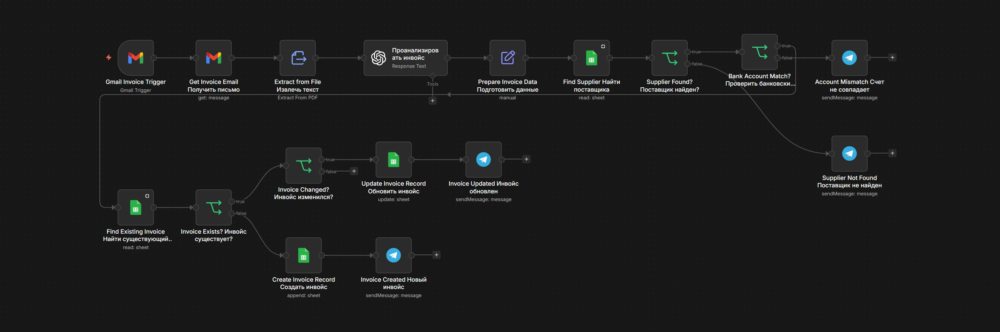

# AI Invoice Processing Engine

AI-автоматизация обработки инвойсов, разработанная на **n8n**. Workflow автоматически извлекает данные из PDF-инвойсов, проверяет бизнес-правила, предотвращает создание дубликатов и автоматически создаёт или обновляет записи инвойсов.

---

# Бизнес-проблема

Компании ежедневно получают инвойсы по электронной почте. Ручная обработка занимает много времени, подвержена ошибкам и увеличивает риск появления дубликатов и оплаты по неверным реквизитам.

Данный workflow автоматизирует обработку инвойсов и проверяет критически важные бизнес-правила перед сохранением данных.

---

# Архитектура Workflow

```text
Gmail Trigger
      │
      ▼
Получение письма
      │
      ▼
Извлечение текста из PDF
      │
      ▼
AI-анализ инвойса
      │
      ▼
Подготовка данных
      │
      ▼
Поиск поставщика
      │
      ▼
Проверка банковского счёта
      │
      ▼
Поиск существующего инвойса
      │
      ▼
Инвойс существует?
      │
 ┌────┴─────┐
 │          │
 ▼          ▼
Создать   Инвойс изменился?
инвойс         │
               ▼
        Обновить инвойс
               │
               ▼
          Уведомления
```

---

# Workflow



---

# Архитектурные принципы

- AI отвечает только за извлечение и структурирование данных инвойса.
- Все бизнес-решения принимаются детерминированной логикой workflow.
- Реестр поставщиков является единым источником достоверных данных (Single Source of Truth).
- Composite Business Key предотвращает создание дублирующихся инвойсов.
- Существующие инвойсы обновляются вместо создания новых записей.
- Неоднозначные ситуации передаются на ручную проверку (Manual Review).

---

# Используемые технологии

| Технология | Назначение |
|------------|------------|
| n8n | Автоматизация Workflow |
| Gmail API | Получение входящих писем |
| OpenAI | Анализ инвойсов |
| Google Sheets | Хранение поставщиков и инвойсов |
| Telegram | Уведомления менеджера |

---

# Основные возможности

- Извлечение текста из PDF
- AI-анализ инвойсов
- Поиск поставщика
- Проверка банковского счёта
- Composite Business Key
- Поиск дубликатов
- Определение изменений
- Versioning
- Manual Review
- Telegram-уведомления

---

# Бизнес-правила

- Проверка поставщика по Supplier Registry.
- Проверка банковского счёта.
- Поиск дубликатов по составному ключу **supplier_inn + invoice_number**.
- Обновление записи только при изменении бизнес-данных.

---

# Возможные улучшения

- PostgreSQL
- OCR для сканированных инвойсов
- Интеграция с ERP-системами
- Workflow согласования
- Журнал аудита

---

# Автор

**Александр Зайцев**

AI Automation Engineer

- GitHub: https://github.com/AlexZaytsev-ai
- Email: polonix315@gmail.com
